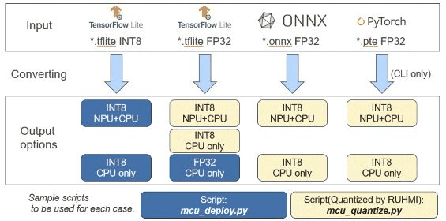

## Introduction

The section introduces how to execute the model compilation with the sample scripts for each exmple case below.   
* [Deploy models](#How-to-deploy-models)  
  - Deploy to CPU only   
  - Deploy to CPU with NPU/Ethos U55 supported    
* [Quantize and deploy models](#How-to-quantize-and-deploy-models)
  - Deploy to CPU only   
  - Deploy to CPU with NPU/Ethos U55 supported    
The sample scripts are [here](../scripts/)

You can run each script under the virtual environment showing the prompt like "(.venv) PS C:\work>".

## Conversion options
The introduced scripts here supports each option. You can use the script depending on the case below.


[NOTICE]
Some options has NOT been supported yet. If you have seen the message like below after runingn the script, please understand it's not ready yet.

```
If you input the onnx model with the script, mcu_deploy.py, you will receive the message like below.
Quantization to be needed at first.

Found unsupported model files:
  - C:\[working folder]\models_int8\*.onnx

UNAVAILABLE: Feature not available yet. Direct deployment supports only FP32/INT8 .tflite.
For .onnx or .pte, quantize with mcu_quantize.py first.
```

# How to deploy models  
The sample script shows how to use the deployment API to compile an already quantized TFLite model on a board with Ethos-U55 support.  

This release introduces some tested models. As the example model,we can download [ad01_int8.tflite](https://raw.githubusercontent.com/mlcommons/tiny/master/benchmark/training/anomaly_detection/trained_models/ad01_int8.tflite) and [ad01_fp32.tflite](https://raw.githubusercontent.com/mlcommons/tiny/master/benchmark/training/anomaly_detection/trained_models/ad01_fp32.tflite) from [MLCommons](https://github.com/mlcommons)    
When runing the scripts provided in the repository, you shall build the folder configuration including each model.  

The directory configuration for the sample scripts to run is below.
```
  ├── scripts
  |     ├── mcu_deploy.py  // sample script for deploy
  |     └── mcu_quantize.py  // sample script for quantize and deploy
  ├── models_int8                                                                        // To be prepared
  |     └── ad01_int8.tflite  // sample model to iput to deployer from MLCommons
  ├── models_fp32                                                                        // To be prepared
  |     └── ad01_fp32.tflite  // sample model to input to Quantizer from MLCommons
  ├── models_fp32_ethos                                                                  // To be prepared
  |     └── ad01_fp32.tflite  // sample model to input to Quantizer from MLCommons
```
>[!TIP]
>If you see any warnings in the process below, you can refer [Tips](../doc/tips.md)

### Deploy to CPU only   
By running the provided script **scripts/mcu_deploy.py**. we can compile the model for MCU only:  
```
cd scripts/  
python mcu_deploy.py --ref_data ../models_int8 deploy_qtzed  
```

### Deploy to CPU with Ethos U55 supported    
When enabling Ethos-U support:  
```
cd scripts  
python mcu_deploy.py --ethos --ref_data ../models_int8 deploy_qtzed_ethos  
 ```

### Check the deploy result

you will get the following results:
```
    deploy_qtzed
    ├── ad01_int8_no_ospi  
```

When Ethos-U support is enabled, each of the directories contain a deployment of the corresponding model for MCU + Ethos-U55 platform:  
```
└── [ad01_int8_no_ospi]  # an example for "ad01_int8_no_ospi"  
    ├── build  
        ├── MCU  
            ├── compilation  
                ├── mera.plan  
                ├── src     # compilation results: C source code and C++ testing support code # HAL entry example  
                    ├── CMakeLists.txt  
                    ├── compare.cpp  
                    ├── compute_sub_0000.c # CPU subgraph generated C source code  
                    ├── compute_sub_0000.h  
                    ├── ...  
                    ├── ethosu_common.h  
                    ├── hal_entry.c  
                    ├── kernel_library_int.c # kernel library if CPU subgraphs are present  
                    ├──  ...  
                    ├── model.c  
                    ├── model.h  
                    ├── model_io_data.c  
                    ├── model_io_data.h  
                    ├── python_bindings.cpp  
                    ├── sub_0001_command_stream.c # Ethos-U55 subgraph generated C source code  
                    ├── sub_0001_command_stream.h  
                    ├── sub_0001_invoke.c  
                    ├── sub_0001_invoke.h  
                    ├──  ...  
                ├──  ...  
            ├── deploy_cfg.json  
            ├── ir_dumps  
                ├── person-det_can.dot  
                ├── ...  
            ├── person-det_after_canonicalization.dot  
            ├── person-det_subgraphs.dot  
    ├── logs  
    ├──　model  
        ├── input_desc.json  
    ├── project.mdp  
```
  
The generated C code under **"build/MCU/compilation/src"** can be incorporated into a e2studio project.  
You can refer to [Guide to the generated C source code](/docs/runtime_api.md) to study how to use the output file from RUHMI Framework.  

# How to quantize and deploy models 

If the starting point it is a Float32 precision model, it is possible to use the Quantizer to first quantize the model and finally deploy with MCU/Ethos-U55 support.
The sample script with using the Quantizer can be refered.

For an example model, the same model in FP32 shall be used [ad01_fp32.tflite](https://github.com/mlcommons/tiny/blob/master/benchmark/training/anomaly_detection/trained_models/ad01_fp32.tflite) from  [MLCommons](https://github.com/mlcommons)  


### Deploy to CPU only   

To run the script:
```
cd scripts/  
python mcu_quantize.py ../models_fp32 deploy_mcu   
```

### Deploy to CPU with Ethos U55 supported   
```
cd scripts/  
python mcu_quantize.py -e ../models_fp32_ethos deploy_ethos  
```

### Check the quantize and deploy result   

When Ethos-U support is enabled, each of the directories contain a deployment of the corresponding model for MCU + Ethos-U55 platform:  
```
C:\work\scripts\deploy_ethos\model_000_ad01_fp32\deploy_mcu\build\MCU\compilation

[deploy_ethos]
└── [model_000_ad01_fp32]  # an example for "ad01_fp32.tflite"  
        ├── [deploy_mcu]    
        ├── build  
            ├── MCU  
                ├── compilation  
                    ├── mera.plan  
                    ├── src     # compilation results: C source code and C++ testing support code # HAL entry example  
                        ├── CMakeLists.txt  
                        ├── compare.cpp  
                        ├── compute_sub_0000.c # CPU subgraph generated C source code  
                        ├── compute_sub_0000.h  
                        ├── ...  
                        ├── ethosu_common.h  
                        ├── hal_entry.c  
                        ├── kernel_library_int.c # kernel library if CPU subgraphs are present  
                        ├──  ...  
                        ├── model.c  
                        ├── model.h  
                        ├── model_io_data.c  
                        ├── model_io_data.h  
                        ├── python_bindings.cpp  
                        ├── sub_0001_command_stream.c # Ethos-U55 subgraph generated C source code  
                        ├── sub_0001_command_stream.h  
                        ├── sub_0001_invoke.c  
                        ├── sub_0001_invoke.h  
                        ├──  ...  
                    ├──  ...  
```

The generated C code under **"build/MCU/compilation/src"** can be incorporated into a e2studio project.  
You can refer to [Guide to the generated C source code](/docs/runtime_api.md) to study how to use the output file from RUHMI Framework.  


